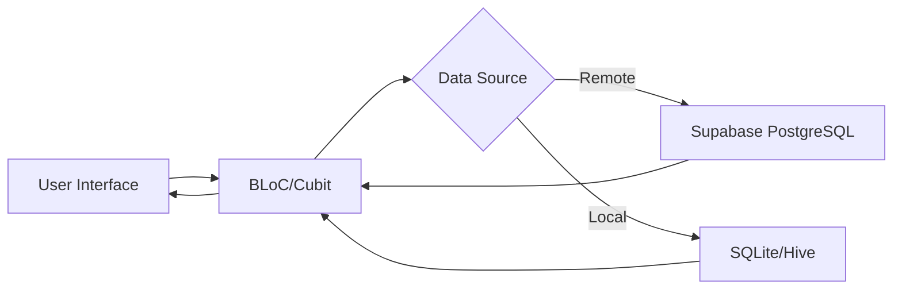
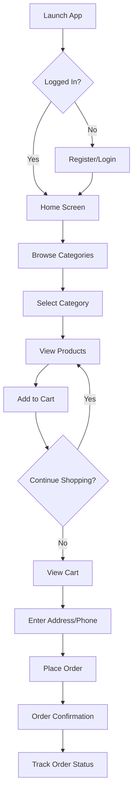
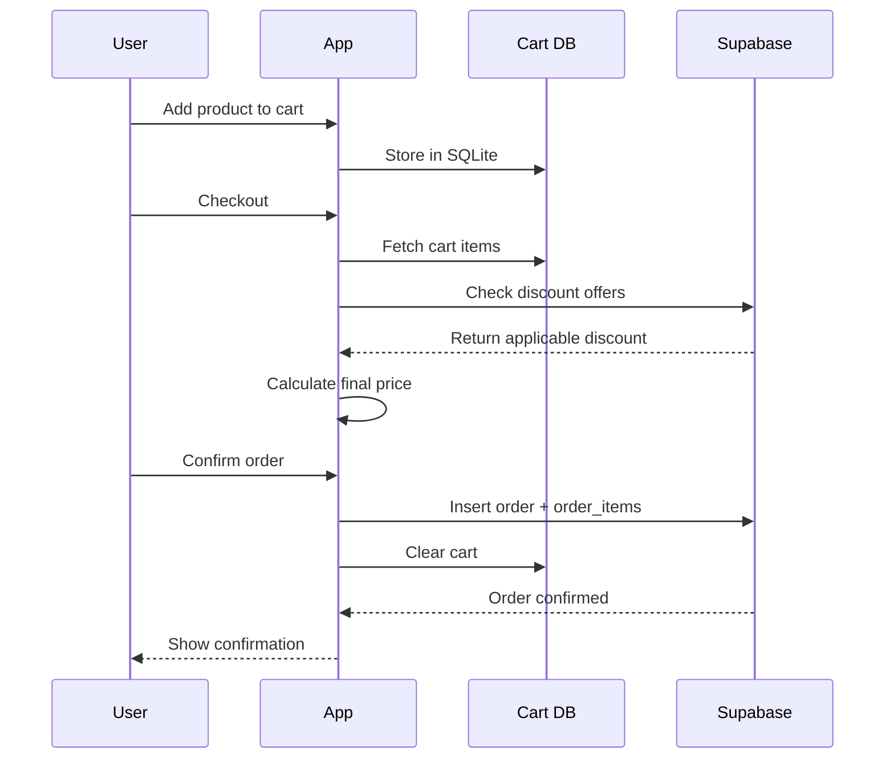

# ELLA - E-Commerce Mobile Application

## Project Overview

ELLA is a modern, feature-rich e-commerce mobile application built with Flutter and Supabase. The application provides a seamless shopping experience for users to browse products, manage their shopping cart, place orders, and track their purchases. The platform offers a clean, intuitive interface with support for both customers and administrators.

---

## Table of Contents

1. [Features](#features)
2. [Technical Stack](#technical-stack)
3. [System Architecture](#system-architecture)
4. [Database Schema](#database-schema)
5. [User Flows](#user-flows)
6. [Installation & Setup](#installation--setup)
7. [Project Structure](#project-structure)
8. [Screenshots](#screenshots)

---

## Features

### Customer Features

#### 🛍️ Product Browsing
- Browse products organized by categories (T-Shirts, Hoodies, Jackets, Pants)
- View products by brand/subcategory (Nike, Adidas, Puma, etc.)
- High-quality product images with detailed descriptions
- Price display with stock availability indicators

#### 🛒 Shopping Cart
- Add products to cart with quantity selection
- Update quantities or remove items
- Real-time total calculation
- Persistent cart storage using local SQLite database

#### 💰 Discount System
- Automatic discount calculation based on order total
- Tiered discount system:
  - 10% off orders over $100
  - 15% off orders over $200
  - 20% off orders over $300
- Special offer bundles

#### 📦 Order Management
- Place orders with delivery address and phone number
- View order history with detailed breakdowns
- Track order status (Pending, Processing, Delivered, Received)
- Order confirmation and receipt generation

#### 👤 User Profile
- Secure user authentication with password hashing (SHA-256)
- Profile management (name, email, phone, address)
- Security question for password recovery
- Order history tracking

#### 🔐 Authentication
- User registration with security questions
- Login with phone number and password
- Password recovery flow
- Guest browsing (planned feature)

### Admin Features

#### 📊 Dashboard
- View all pending orders
- Update order status
- View customer information
- Manage product inventory

#### 📨 Communication
- Add notes/messages to orders
- Track order processing history

---

## Technical Stack

### Frontend
- **Framework**: Flutter 3.x
- **Language**: Dart
- **State Management**: BLoC (Business Logic Component)
- **Local Storage**: Hive (User sessions), SQLite (Shopping cart)
- **UI Components**: Material Design 3

### Backend
- **BaaS**: Supabase
- **Database**: PostgreSQL
- **Storage**: Supabase Storage (for product images)
- **Authentication**: Custom authentication with password hashing

### Security
- **Password Hashing**: SHA-256
- **Data Validation**: Input sanitization
- **Secure Storage**: Encrypted local storage with Hive

---

## System Architecture

### Architecture Pattern
The application follows a **Clean Architecture** approach with clear separation of concerns:

```
lib/
├── core/               # Core utilities and constants
│   ├── constants.dart      # App-wide constants
│   ├── components.dart     # Reusable UI components
│   ├── supabase_client.dart # Supabase configuration
│   └── sql_helper.dart     # Local SQLite helpers
├── cubit/              # State management
│   └── app/
│       ├── app_cubit.dart   # Business logic
│       └── app_state.dart   # Application states
├── models/             # Data models
├── screen/             # UI screens
│   ├── auth/              # Authentication screens
│   ├── home_screen.dart   # Main home page
│   └── cart_screen.dart   # Shopping cart
└── new_app/           # Updated UI components
    ├── app_layout/
    └── about_us.dart
```

### Data Flow



---

## Database Schema

### Tables Overview

#### 1. **profiles** - User Information
```sql
- id (uuid, PK)
- full_name (text)
- email (text, unique)
- phone (text, unique)
- password_hash (text)
- address (text)
- security_question (text)
- security_answer_hash (text)
- is_admin (boolean)
- created_at (timestamp)
```

#### 2. **categories** - Product Categories
```sql
- id (integer, PK)
- name (text) - e.g., "T-Shirts", "Hoodies"
- image_url (text)
```

#### 3. **subcategories** - Brands/Subcategories
```sql
- id (integer, PK)
- name (text) - e.g., "Nike", "Adidas"
- image_url (text)
- category_id (integer, FK → categories)
```

#### 4. **products** - Product Catalog
```sql
- id (integer, PK)
- name (text)
- description (text)
- price (numeric)
- images (text)
- subcategory_id (integer, FK → subcategories)
- qou (bigint) - Quantity available
- limt (bigint) - Purchase limit per user
```

#### 5. **orders** - Customer Orders
```sql
- id (bigint, PK)
- user_id (uuid, FK → profiles)
- total_price (double precision)
- discount_amount (double precision)
- final_price (double precision)
- status (integer) - 0: Pending, 1: Processing, 2: Delivered
- address (text)
- phone (text)
- created_at (timestamp)
```

#### 6. **order_items** - Order Line Items
```sql
- id (bigint, PK)
- order_id (bigint, FK → orders)
- product_id (bigint)
- quantity (integer)
- price_at_purchase (double precision)
```

#### 7. **offers** - Discount Rules
```sql
- id (bigint, PK)
- min_amount (double precision)
- discount_percent (double precision)
- description (text)
- image (text)
```

#### 8. **special_offer** - Featured Deals
```sql
- id (integer, PK)
- name (text)
- description (text)
- price (numeric)
- images (text)
- dis (bigint) - Discount percentage
- qou (bigint) - Quantity
- limt (bigint) - Purchase limit
```

### Database Functions

#### `get_category_details(p_category_id)`
Returns a category with its nested subcategories in JSON format.

**Usage**: Called when user clicks on a category to view its brands/subcategories.

---

## User Flows

### Customer Journey



### Order Processing Flow



---

## Installation & Setup

### Prerequisites
- Flutter SDK (3.0+)
- Dart SDK (3.0+)
- Android Studio / Xcode
- Supabase account

### Steps

1. **Clone the repository**
```bash
git clone <repository-url>
cd raf
```

2. **Install dependencies**
```bash
flutter pub get
```

3. **Configure Supabase**
   - Create a Supabase project
   - Update `lib/main.dart` with your Supabase URL and anon key:
   ```dart
   const supabaseUrl = 'YOUR_SUPABASE_URL';
   const supabaseAnonKey = 'YOUR_SUPABASE_ANON_KEY';
   ```

4. **Set up database**
   - Run the schema creation script in Supabase SQL Editor
   - Run the sample data insertion script (optional)

5. **Run the app**
```bash
flutter run
```

---

## Project Structure

```
raf/
├── android/                # Android native code
├── ios/                    # iOS native code
├── lib/
│   ├── core/              # Core utilities
│   │   ├── components.dart
│   │   ├── constants.dart
│   │   ├── supabase_client.dart
│   │   └── sql_helper.dart
│   ├── cubit/             # State management
│   │   └── app/
│   │       ├── app_cubit.dart
│   │       └── app_state.dart
│   ├── models/            # Data models
│   ├── screen/            # UI screens
│   │   ├── auth/         # Authentication
│   │   ├── home_screen.dart
│   │   ├── cart_screen.dart
│   │   └── profile_screen.dart
│   ├── new_app/           # New UI components
│   │   ├── app_layout/
│   │   └── about_us.dart
│   └── main.dart          # App entry point
├── assets/                # Images, fonts
├── pubspec.yaml          # Dependencies
└── README.md             # This file
```

---

## Key Technologies & Libraries

### Dependencies
```yaml
cupertino_icons: ^1.0.8
supabase_flutter: ^2.7.1
flutter_bloc: ^8.1.6
hive_flutter: ^1.1.0
url_launcher: ^6.3.1
bcrypt: ^1.1.3
crypto: ^3.0.5
```

### Dev Dependencies
```yaml
flutter_lints: ^5.0.0
```

---

## Security Features

### Password Security
- All passwords are hashed using SHA-256 before storage
- No plain-text passwords are stored
- Security questions for password recovery

### Data Protection
- Local cart data stored in encrypted SQLite database
- User sessions managed with Hive (encrypted key-value store)
- Secure HTTPS communication with Supabase

### Input Validation
- Phone number format validation
- Email format validation
- Required field checks
- SQL injection prevention through Supabase parameterized queries

---

## Future Enhancements

### Planned Features
- [ ] Guest checkout mode
- [ ] Payment gateway integration (Stripe/PayPal)
- [ ] Push notifications for order updates
- [ ] Product reviews and ratings
- [ ] Wishlist functionality
- [ ] Multi-language support (Arabic/English)
- [ ] Social media authentication
- [ ] Product search and filters
- [ ] Order tracking with real-time updates
- [ ] Admin mobile dashboard

### Technical Improvements
- [ ] Implement Row Level Security (RLS) in Supabase
- [ ] Add unit and integration tests
- [ ] Implement CI/CD pipeline
- [ ] Add error logging and analytics
- [ ] Optimize image loading and caching
- [ ] Implement offline mode support

---

## Contributing

Contributions are welcome! Please follow these steps:

1. Fork the repository
2. Create a feature branch (`git checkout -b feature/AmazingFeature`)
3. Commit your changes (`git commit -m 'Add some AmazingFeature'`)
4. Push to the branch (`git push origin feature/AmazingFeature`)
5. Open a Pull Request

---

## License

This project is licensed under the MIT License - see the LICENSE file for details.

---

## Contact

**Project Name**: ELLA E-Commerce  
**Developer**: [Your Name]  
**Email**: [Your Email]  
**Project Link**: [GitHub Repository]

---

## Acknowledgments

- Flutter team for the amazing framework
- Supabase for the backend infrastructure
- All contributors and testers

---

## Appendix

### Color Scheme
- **Primary**: `#060035` (Deep Blue)
- **Secondary**: `#FFD700` (Gold)
- **Accent**: `#00BFA5` (Teal)
- **Background**: `#FAFAFA` (Off-white)

### Supported Platforms
- ✅ Android (6.0+)
- ✅ iOS (11.0+)
- ✅ Web (Chrome, Safari, Firefox)

### Performance Metrics
- App size: ~25 MB
- Startup time: < 2 seconds
- Memory usage: < 100 MB average
# ELLA

